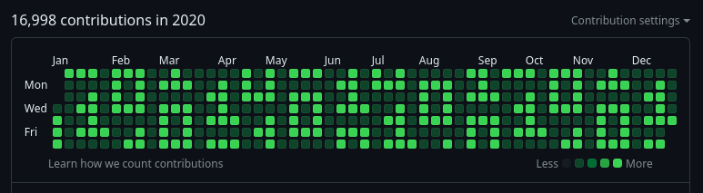

# Github Activity Painter! &nbsp;  

<p align="center">
	
</p>

### Description

This is a script that paints a pattern of choice from a png image onto your github activity bar! 

> [!WARNING]
> DISCLAIMER: This project is not intended to be used as a method of decieving viewers of github profiles into thinking
> that the user is active on github, but instead is meant as an education and experimental tool. We highly recommend drawing
> with this tool only patterns that are easily recognized in order to indicate to the viewer that it is automatic and not
> from human-made commits. We encourage transparency and not deception, use at your own accountability.

### Instructions

> [!IMPORTANT]
> Please make sure you first make a **dummy repository** to do the commits in, this can be private or public, if private
> though you have to turn on the visibility of private commits on the github activity bar. We also encourage users to make
> their dummy repositories public out of honesty and transparency.

Make sure dependencies are installed

```
pip install numpy python-dotenv Pillow
```

Then clone the repo

```
git clone https://github.com/elgamalsalman/github-activity-painter
cd github-activity-painter
```

Then inside of your cloned repo make your `.env` by copying `template.env`
```bash
cp template.env .env
```

Now edit the `.env` to your desire, from your `.env` you must:
- Edit `dummy_repo_path` variable to reflect the location of the dummy repo

and from the `.env` you also can but not necessarily have to:
- Edit the pattern to be used
- Edit the start and end dates of the pattern
- Edit the reference date (to shift the pattern)
- Edit the range of commits per day (min and max)

In order to add your own patterns just add a new folder to the [patterns](./patterns) directory with the name of the pattern and holding the `pattern.png` image of the pattern, and change the `pattern_name` variable in `.env` to reflect the name of the newly added pattern.

### Provided Patterns

Patterns are images that has to be 7 pixels in height, but there are no limits on width since they'll be repeated anyways.

Find the extensive list of provided patterns in the [patterns directory](./patterns).

#### Description

In the [patterns directory](./patterns) you can find for each pattern a separate director with:
- A `preview.png` file with a scaled up coloured preview of the  pattern
- A `pattern.xcf` file with the original pattern gimp file
- A `pattern.png` file with the original pattern
- The period, the width of the repeating unit of the pattern, of each pattern is provided in the table below

#### List of Patterns!

My personal favourite: Diagonal Bits Pattern

|                  Pattern                  |                                           Preview                                          | Period |
| :---------------------------------------: | :----------------------------------------------------------------------------------------: | :----: |
| [Diagonal Bits](./patterns/diagonal_bits) |  |   37   |
| [Bamboo](./patterns/bamboo)               |                |   12   |
